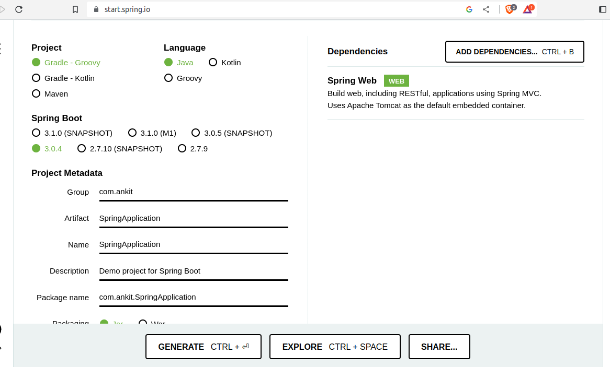

<!-- TABLE OF CONTENTS -->

  
Table of Contents

  <ol>
    <li>
      <a href="#about-the-project">About The Project</a>
      <ul>
        <li><a href="#built-with">Built With</a></li>
      </ul>
    </li>
    <li>
      <a href="#getting-started">Getting Started</a>
      <ul>
        <li><a href="#prerequisites">Prerequisites</a></li>
        <li><a href="#installation">Installation</a></li>
      </ul>
    </li>
    <li><a href="#usage">Usage</a></li>
    <li><a href="#contact">Contact</a></li>
  </ol>

<!-- ABOUT THE PROJECT -->
## About The Project

This Project is a basic CRUD Application that is build on the Spring Boot. APIs are available to use through POSTMAN.

(<a href="#readme-top">back to top</a>)

### Built With

* Spring Boot v3
* H2 Database
* Eclipse 2022-12
* Postman

(<a href="#readme-top">back to top</a>)

<!-- GETTING STARTED -->
## Getting Started

We required an empty spring boot application having the basic Spring Boot configuration from (https://start.spring.io/)

	

### Prerequisites

* JDK 17
* Eclipse 2022-12
* Postman

### Installation

1. Import Generated Application in the Eclipse. 
2. We will start writing the Entity class, Repository Layer, Service Layer and finally Controller Layer.
3. We also need to add few logging parameters and database configuration in application.properties (available in src/main/resources folder)
4. We can run the Starter Class (like CrudapplicaitonApplication) as Java Class to start the local inbuilt Tomcat Server. 
Application URL is http://localhost:8080/ 
5. We can also view Database Tables on a Web URL http://localhost:8080/h2-console

(<a href="#readme-top">back to top</a>)

<!-- USAGE EXAMPLES -->
## Usage

Use this application to Create, Read, Update and Delete Employees from POSTMAN.

(<a href="#readme-top">back to top</a>)

<!-- CONTACT -->
## Contact

Your Name - [ankitagarwal](https://twitter.com/ankitagarwalnet) - ankitagarwal.fs@gmail.com

Project Link: [https://github.com/ankitfs/crud-api-backend](https://github.com/ankitfs/crud-api-backend)

(<a href="#readme-top">back to top</a>)

